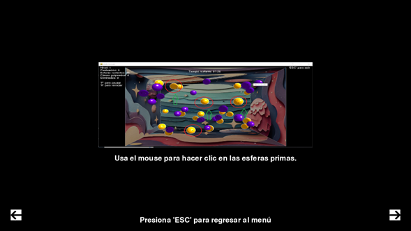
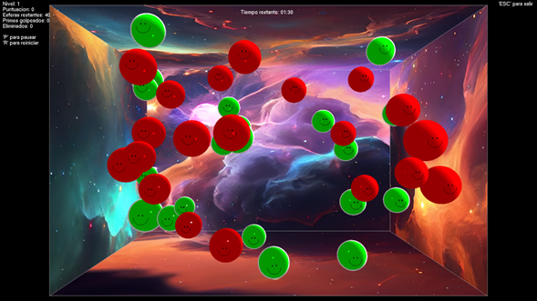
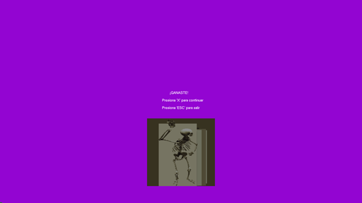

# PyPrimes 3D: Aim Trainer & Mathematical Challenge

PyPrimes 3D es un videojuego de entrenamiento de puntería (estilo AimLabs) desarrollado en Python utilizando OpenGL para el renderizado de gráficos en tiempo real. El juego combina mecánicas de reflejos con desafíos matemáticos, donde el jugador debe identificar y destruir esferas que contienen números primos mientras evita las no primas.

## Caracteristicas Técnicas

 - Motor Gráfico: Implementación de iluminación `(GL_LIGHTING)`, texturizado de cubos y renderizado de esferas dinámicas mediante `gluSphere`.
 - Dificultad Adaptativa: El radio de las esferas disminuye y su velocidad de traslación y rotación aumenta conforme el jugador sube de nivel.
 - Optimización de Texturas: Uso de `GL_UNPACK_ALIGNMENT` para garantizar que las imágenes de los menús y HUD se carguen sin distorsión visual.
 - Lógica Matemática: Sistema de generación de números y factorización en tiempo real para determinar el estado de cada esfera.

## Stack Tecnologico

| Componente           | Versión / Tecnología                                                        |
| ----------------- | ------------------------------------------------------------------ |
| Lenguaje | Python 3.11.9 |
| Graficos 3D | PyOpenGL 3.1.7|
| Interfaz y Audio | Pygame 2.6.1|
| Cálculo Numérico | NumPy 1.26.4 |
| Procesamiento de Imágenes | Pillow 12.1.0 |
| Matemáticas Simbólicas | SymPy 1.14.0 y Mpmath 1.3.0 |
| Distrinucion | PyInstaller (Portable Executable) |


## Estructura del proyecto

La organización del código sigue una jerarquía modular para facilitar el despliegue y mantenimiento:

```Arbol de archivos
PyPrimes3D/
├── PyPrimes3D.py          # Punto de entrada (Main), gestión de Fullscreen e Intro
├── animacion.py           # Motor de renderizado, física y lógica de dificultad
├── primes.py              # Algoritmos de generación de números primos
├── AimLabs/               # Módulos de soporte
│   ├── __init__.py        # Inicializador de paquete
│   ├── Menu.py            # Lógica de interfaz de usuario e instrucciones
│   └── Resource/          # Assets (Audios, Fondos, Texturas y Memes)
├── requirements.txt       # Dependencias del entorno de desarrollo
└── README.md              # Documentación técnica
```

# EJECUCION Y DESCARGA
## opcion 1: Ejecutable Portátil (Recomendado)
Para jugar sin configurar un entorno de Python, descarga el archivo PyPrimes 3D.exe desde la sección de Releases de este repositorio.

Nota: Al ser un ejecutable independiente no firmado, es posible que Windows muestre una advertencia de seguridad. Puedes ejecutarlo con confianza ya que el código fuente es abierto.

## Opción 2: Instalación Local para Desarrolladores

1. Clona el repositorio:

```bash
  git clone https://github.com/Shinra3245/PyPrimes3D.git
```

2. Instala las dependencias :

```bash
  pip install -r requirements.txt
```

3. Ejecuta el archivo Principal:

`python PyPrimes3D.py`

## Imagenes del juego







## Autor

- [@Shinra3245](https://github.com/Shinra3245)
